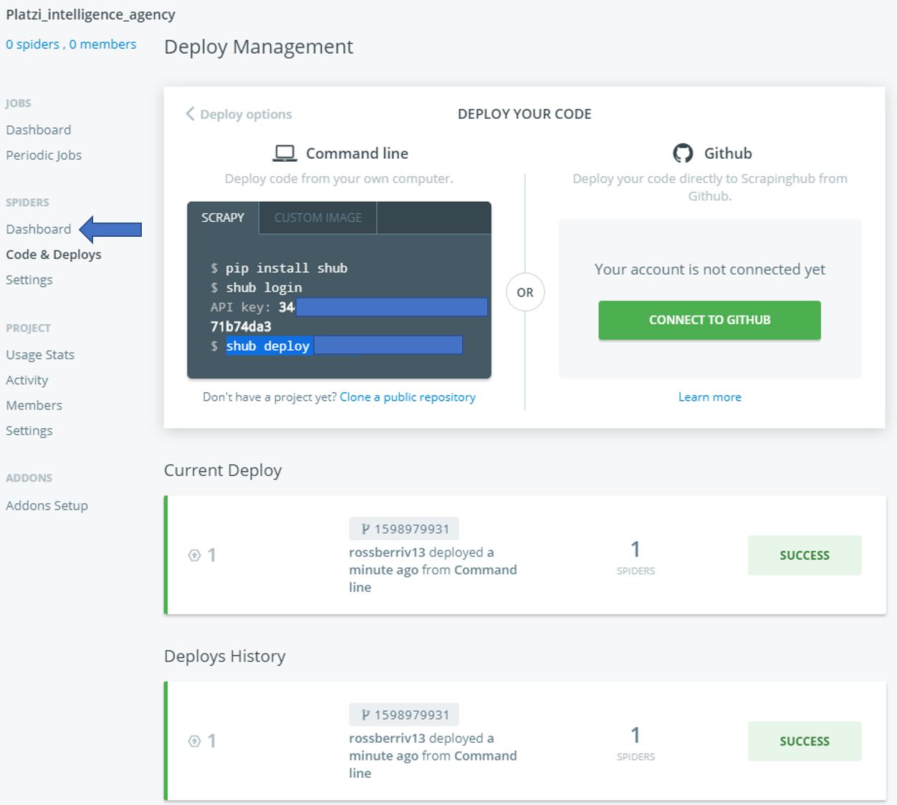
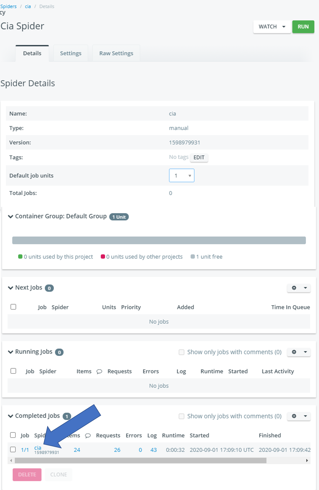
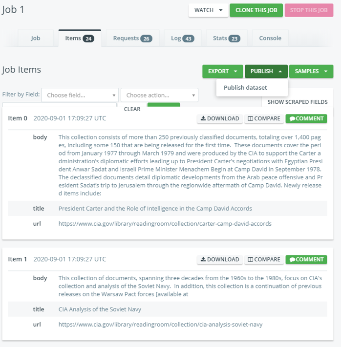
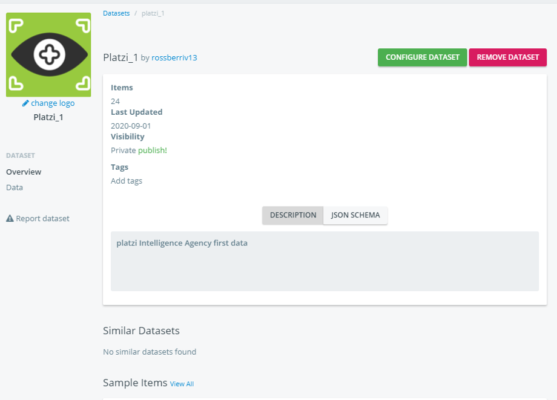
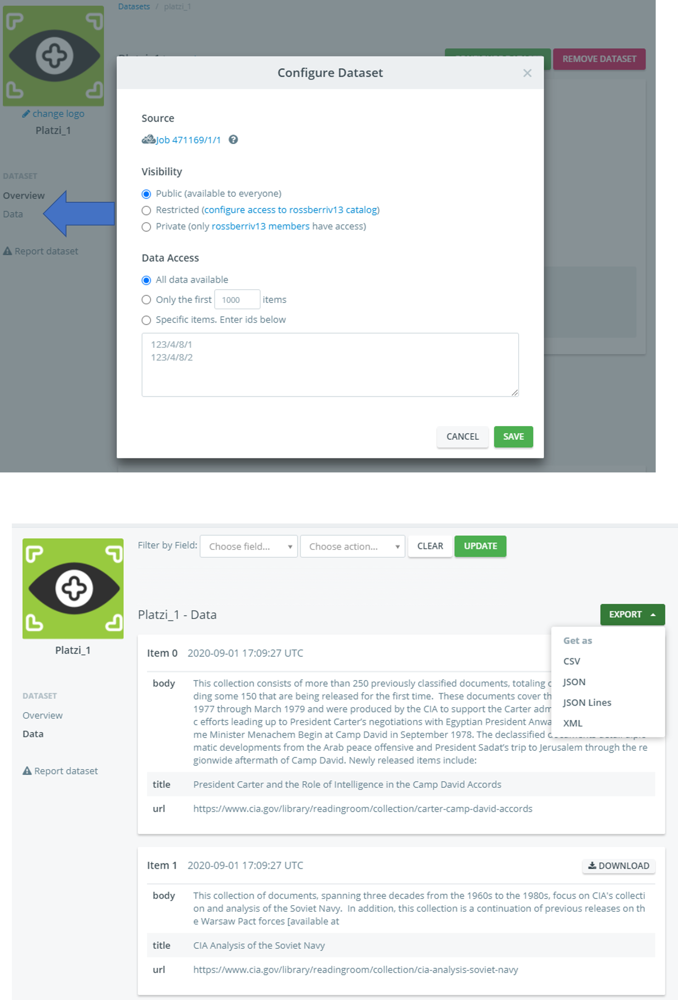
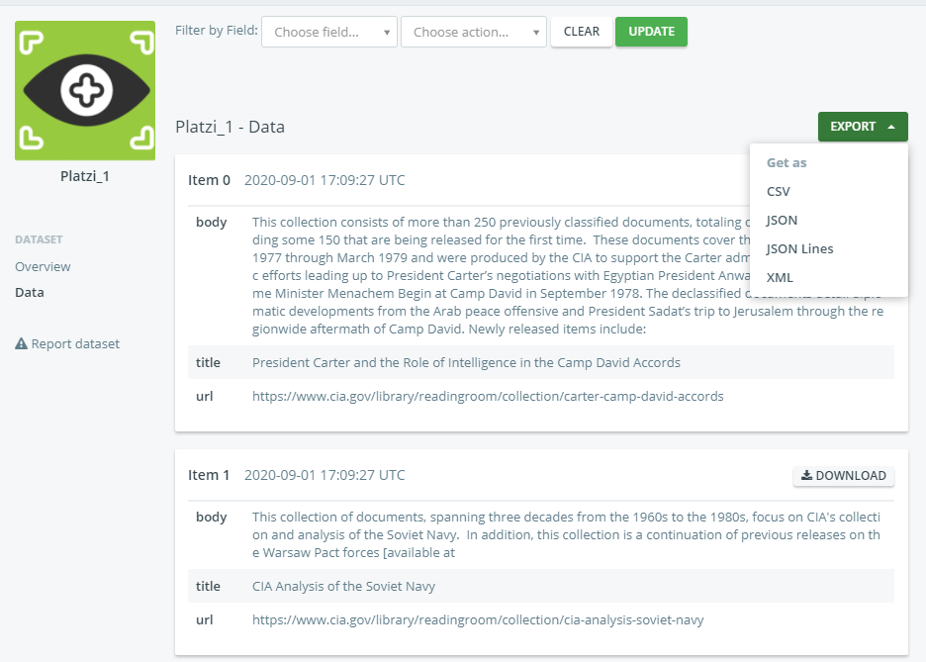

# Curso de Scrapy

- [Curso de Scrapy](#curso-de-scrapy)
  - [Modulo I Scrapy: el framework estrella](#modulo-i-scrapy-el-framework-estrella)
    - [Clase 1 Bienvenida al curso](#clase-1-bienvenida-al-curso)
    - [Clase 2 El framework asíncrono: Scrapy](#clase-2-el-framework-asíncrono-scrapy)
      - [Herramientas de Scrappy](#herramientas-de-scrappy)
    - [Clase 3 Instalacion de Scrapy en Windows](#clase-3-instalacion-de-scrapy-en-windows)
    - [Clase 4 Instalacion de Scrapy en Mac OS](#clase-4-instalacion-de-scrapy-en-mac-os)
    - [Clase 5 Instalacion de Scrapy en Linux](#clase-5-instalacion-de-scrapy-en-linux)
    - [Clase 6 Nuestro primer Hello World](#clase-6-nuestro-primer-hello-world)
      - [Inicia tu primer proyecto con Scrapy](#inicia-tu-primer-proyecto-con-scrapy)
    - [Clase 7 Recordando generadores e iteradores](#clase-7-recordando-generadores-e-iteradores)
      - [Iteradores](#iteradores)
      - [Generadores](#generadores)
  - [Modulo 2 Trabajando con Scrapy](#modulo-2-trabajando-con-scrapy)
    - [Clase 8 Scrapy Shell](#clase-8-scrapy-shell)
    - [Clase 9 Nuestro primer proyecto: estructura de carpetas](#clase-9-nuestro-primer-proyecto-estructura-de-carpetas)
    - [Clase 10 Spiders](#clase-10-spiders)
    - [Clase 11 Usando XPath para extraer datos](#clase-11-usando-xpath-para-extraer-datos)
    - [Clase 12 Guardando los datos](#clase-12-guardando-los-datos)
    - [Clase 13 Seguir links: responsefollow](#clase-13-seguir-links-responsefollow)
    - [Clase 14 Múltiples callbacks](#clase-14-múltiples-callbacks)
    - [Clase 15 Pasando argumentos a nuestro spider](#clase-15-pasando-argumentos-a-nuestro-spider)
    - [Clase 16 Configuraciones utiles](#clase-16-configuraciones-utiles)
  - [Modulo Proyecto: Platzi Intelligence Agency](#modulo-proyecto-platzi-intelligence-agency)
    - [Clase 17 Platzi Intelligence Agency](#clase-17-platzi-intelligence-agency)
    - [Clase 18 Inicializando el repositorio local](#clase-18-inicializando-el-repositorio-local)
    - [Clase 19 Utilizando XPath en el sitio de la CIA](#clase-19-utilizando-xpath-en-el-sitio-de-la-cia)
    - [Clase 20 Spider: CIA](#clase-20-spider-cia)
    - [Clase 21 Finalizando la creación del spider](#clase-21-finalizando-la-creación-del-spider)
    - [Clase 22 Creando el frontend de nuestra aplicacion](#clase-22-creando-el-frontend-de-nuestra-aplicacion)
    - [Clase 23 Deploy a GitHub Pages](#clase-23-deploy-a-github-pages)
    - [Clase 24 Deploy en Scrapy Cloud](#clase-24-deploy-en-scrapy-cloud)
    - [Clase 25 Bonus: automatizar procesos con la API](#clase-25-bonus-automatizar-procesos-con-la-api)
    - [Clase 26 Evitar meterse en problemas](#clase-26-evitar-meterse-en-problemas)
  - [Modulo Conclusiones](#modulo-conclusiones)

## Modulo I Scrapy: el framework estrella

### Clase 1 Bienvenida al curso

Scrapy es utilizado por el gobierno de U.K. para obtener datos de la web de forma asincrona, necesitaras un nivel intermedio en python, fundamentos de html y xpath

### Clase 2 El framework asíncrono: Scrapy

Scrapy es un software de alto nivel para hacer web scrapping y web-crawling (capturar links de paginas e indexarlos), podemos realizar con el también data mining.

Scrappy es asíncrono, al igual que el event loop de javascript puedes hacer multiples peticiones y esperar a que retornen.

#### Herramientas de Scrappy

- Procesador interno de XPath
- Interactive Shell
- JSON, CSV, etc
- Respeta el archivo robots.txt (respetas la ética del sitio)

### Clase 3 Instalacion de Scrapy en Windows

Partimos del hecho de tener python instalado

Creamos en nuestro directorio de trabajo el folder hello_world

```cmd
mkdir hello_world
```

```cmd
cd hello_world
```

Inicializamos el repositorio de git

```cmd
git init .
```

Creamos el virtual environment

```cmd
py  -m venv venv
```

Inicializamos el venv en windows

```cmd
venv\Scripts \activate
```

Instalamos dependencias

```cmd
pip install scrapy autopep8
```

### Clase 4 Instalacion de Scrapy en Mac OS

Instalar Scrapy en una Mac es exactamente igual que en Windows. Si ya has trabajado con Python antes, los comandos varían ligeramente.

Abre tu terminal. Crea una carpeta en donde trabajarás tu proyecto: esto lo haces con el comando `mkdir nombre_proyecto`. Luego, con `cd nombre_proyecto` te ubicas dentro del directorio.

Scrapy necesita ciertas dependencias para poder instalarse. Alguna vez en tu historia como dev seguramente corriste el comando `xcode-select --install`. Si no lo hiciste, este es el momento. Lo que hace es instalar lo necesario para que nuestro código corra sin ningún error. Si el comando anterior salió bien, ejecuta `sudo xcode-select --reset` para que las dependencias sean reconocidas por el sistema operativo.

Una vez ahí, creas tu entorno virtual con `python3 -m venv venv`. Este último comando creará una carpeta de nombre “venv” donde estarán los archivos internos de Python que usará tu proyecto. Verifica con `ls` que exista. ¿Todo correcto? Sigamos adelante entonces.

Ingresa dentro de tu entorno virtual con el comando `source venv/bin/activate`. Esto te permitirá descargar las dependencias necesarias sin interferir con el entorno global de tu sistema operativo.

Ahora, podemos instalar Scrapy sin ningún problema. Otro paquete que instalaremos en el camino es autopep8, que nos servirá para formatear automáticamente nuestro código Python siguiendo los lineamientos de PEP 8, la guía de estilos oficial del lenguaje. Ambos paquetes los instalamos con el comando `pip3 install autopep8 scrapy`

Si tuviste algún error en el camino, en la documentación encuentras un tutorial mucho más detallado. Es un gran skill como developer saber leer la documentación, ¡anímate!. Si la cosa persiste, deja un comentario en el sistema de discusiones para que la comunidad o yo podamos ayudarte 😉.

Si todo salió bien, con el comando `scrapy version` tu terminal debería devolverte la versión del framework que acaba de instalarse. ¡Estás listo para empezar a hacer Web Scraping!

### Clase 5 Instalacion de Scrapy en Linux

Si llevas un buen tiempo siendo usuario de Linux, seguramente sabes más que yo. Para poder acaparar a la mayor cantidad de estudiantes que usan Linux dentro de Platzi, este tutorial está probado en Ubuntu. Si usas otra distribución como Fedora, Arch, o CentOS, es tu tarea transformar los comandos que te presento en esta lectura para que funcionen en tu computadora.

¡Comencemos!

Primero, instalemos todas las dependencias necesarias con este comando larguísimo dentro de tu terminal:

```bash
sudo apt-get install python3 python3-dev python3-pip libxml2-dev libxslt1-dev zlib1g-dev libffi-dev libssl-dev
```

Crea una carpeta en donde trabajarás tu proyecto: esto lo haces con el comando `mkdir nombre_proyecto`. Luego, con `cd nombre_proyecto` te ubicas dentro del directorio.

Una vez ahí, creas tu entorno virtual con `python3 -m venv venv`. Este último comando creará una carpeta de nombre “venv” donde estarán los archivos internos de Python que usará tu proyecto. Verifica con `ls` que exista. ¿Todo correcto? Sigamos adelante entonces.

Ingresa dentro de tu entorno virtual con el comando `source venv/bin/activate`. Esto te permitirá descargar las dependencias necesarias sin interferir con el entorno global de tu sistema operativo.

Ahora, podemos instalar Scrapy sin ningún problema. Otro paquete que instalaremos en el camino es autopep8, que nos servirá para formatear automáticamente nuestro código Python siguiendo los lineamientos de PEP 8, la guía de estilos oficial del lenguaje. Ambos paquetes los instalamos con el comando `pip3 install autopep8 scrapy`

Si tuviste algún error en el camino, en la documentación encuentras un tutorial mucho más detallado. Es un gran skill como developer saber leer la documentación, ¡anímate! Si la cosa persiste, deja un comentario en el sistema de discusiones para que la comunidad o yo podamos ayudarte 😉.

Si todo salió bien, con el comando `scrapy version` tu terminal debería devolverte la versión del framework que acaba de instalarse. ¡Estás listo para empezar a hacer Web Scraping!

En la siguiente clase, haremos nuestro primer Hello World, y vas a tener tu contacto inicial con Scrapy. ¡Nos vemos ahí!

### Clase 6 Nuestro primer Hello World

Vamos a utilizar los recursos de las siguientes pagina

<http://toscrape.com/>

Dentro de ella encontramos los quotes

<http://quotes.toscrape.com/>

El objetivo es realizar un script que obtenga las citas en su totalidad, primero obtendremos el html para después obtener la información cita por cita.

#### Inicia tu primer proyecto con Scrapy

Inicializamos con el primer comando

```py
scrapy startproject tutorial
```

Esto crea la siguiente estructura dentro del folder hello_world

```md
hello_world
│
└───tutorial
│   │   spiders
│   │   └───__init__.py
│   │
│   │   __init__.py
│   │   items.py
│   │   middlewares.py
│   │   pipelines.py
│   │   settings.py
│
│
└───scrapy.cfg
```

Dentro de spiders creamos el archivo `quotes_spider.py` dentro de este archivo creo mi primer spider

```py
import scrapy

class QuotesSpider(scrapy.Spider):
    name = 'quotes'
    start_urls = [
        'http://quotes.toscrape.com/'
    ]

    def parse(self, response):
        with open('resultados,html', 'w', encoding='utf-8') as f:
            f.write(response.text)

```

Ahora no movemos al folder `tutorial` y ejecutamos el código

```bash
 scrapy crawl quotes

# donde quotes es el name de nuestra clase
```

Ahora dentro de `tutorial` tenemos el archivo `resultados.html` con el contenido de la página.

### Clase 7 Recordando generadores e iteradores

#### Iteradores

**Python nunca recorre una lista de manera directa para obtener los elementos**, en el lenguaje tenemos elementos divisibles como los strings, listas, tuplas, diccionarios, ellos son llamado iterables, ya que a partir de ellos puedo crear un objeto especial llamado iterador, el cual python si es capaz de recorrer de manera directa utilizando un ciclo for, es decir primero convertirnos un iterable en un iterador, y después lo recorremos elemento por elemento.

Salimos del proyecto anterior y venv, creamos en root del curso el archivo `iteradores.py`

Ejemplo iteradores

```py
my_list = [1,2,3,4,5]

## Normalmente usamos un for para recorrer la lista
# for element in my_list:
#     print(element)

## veamos que hay debajo
my_iter = iter(my_list)

print(type(my_iter))

#Extraer los elementos
print(next(my_iter))
print(next(my_iter))
print(next(my_iter))
print(next(my_iter))
print(next(my_iter))
print(next(my_iter))
print(next(my_iter))
```

Esto es lo que hace un for con azúcar sintáctica y cuando encuentra el error StopIteration el ciclo para

#### Generadores

En python tenemos formas fáciles de crear iteradores estas son llamadas generador (generator), este es como una función pero con poderes especiales, por ejemplo cuando hacemos **return** en una función este corta la ejecución de la misma, en un generador python guarda el estado de la funcion y continua la ejecución donde lo dejaste para cuando vuelvas a llamar a esta funcion ese estado lo tengas disponible otra vez.

Creamos el archivo generadores.py

```py
def my_gen():
    a = 1
    yield a

    a= 2
    yield a

    a = 3
    yield a


my_first_gen = my_gen()

print(next(my_first_gen))
print(next(my_first_gen))
print(next(my_first_gen))
```

Al llamarlo con la consola nos devuelve el resultado paso a paso, al sobrepasar los pasos se genera un error del tipo stopIteration. En Scrapy vamos a estar en contacto constantemente con los Iterators y Generators.

## Modulo 2 Trabajando con Scrapy

### Clase 8 Scrapy Shell

Trabajaremos sobre el sandbox de quotes para traer el titulo y las citas usando la consola interactiva de Scrapy.

Para ello abrimos en la terminal la ruta `hello_world/tuturial` una vez dentro podremos continuar escribiendo instrucciones de x path

```py
scrapy shell 'http://quotes.toscrape.com/page/1'
```

Obtenemos esta respuesta

```shelll
2020-08-30 08:22:42 [scrapy.core.engine] DEBUG: Crawled (200) <GET http://quotes.toscrape.com/page/1/> (referer: None)
[s] Available Scrapy objects:
[s]   scrapy     scrapy module (contains scrapy.Request, scrapy.Selector, etc)
[s]   crawler    <scrapy.crawler.Crawler object at 0x7f0d3f221820>
[s]   item       {}
[s]   request    <GET http://quotes.toscrape.com/page/1>
[s]   response   <200 http://quotes.toscrape.com/page/1/>
[s]   settings   <scrapy.settings.Settings object at 0x7f0d3f221eb0>
[s]   spider     <DefaultSpider 'default' at 0x7f0d3eda5bb0>
[s] Useful shortcuts:
[s]   fetch(url[, redirect=True]) Fetch URL and update local objects (by default, redirects are followed)
[s]   fetch(req)                  Fetch a scrapy.Request and update local objects
[s]   shelp()           Shell help (print this help)
[s]   view(response)    View response in a browser
>>>
```

Uso xpath para obtener el titulo

```py
>>> response.xpath('//h1/a/text()').get()
'Quotes to Scrape'
```

Ahora obtengo la cita

```py
>>> response.xpath('//span[@class="text" and @itemprop="text"]/text()').getall()
['“The world as we have created it is a process of our thinking. It cannot be changed without changing our thinking.”', '“It is our choices, Harry, that show what we truly are, far more than our abilities.”', '“There are only two ways to live your life. One is as though nothing is a miracle. The other is as though everything is a miracle.”', '“The person, be it gentleman or lady, who has not pleasure in a good novel, must be intolerably stupid.”', "“Imperfection is beauty, madness is genius and it's better to be absolutely ridiculous than absolutely boring.”", '“Try not to become a man of success. Rather become a man of value.”', '“It is better to be hated for what you are than to be loved for what you are not.”', "“I have not failed. I've just found 10,000 ways that won't work.”", "“A woman is like a tea bag; you never know how strong it is until it's in hot water.”", '“A day without sunshine is like, you know, night.”']
>>>
```

Tambien la shell tiene otros metodos por ejemplo request

```py
>>> dir(request)
['__class__', '__delattr__', '__dict__', '__dir__', '__doc__', '__eq__', '__format__', '__ge__', '__getattribute__', '__gt__', '__hash__', '__init__', '__init_subclass__', '__le__', '__lt__', '__module__', '__ne__', '__new__', '__reduce__', '__reduce_ex__', '__repr__', '__setattr__', '__sizeof__', '__slots__', '__str__', '__subclasshook__', '__weakref__', '_body', '_cb_kwargs', '_encoding', '_get_body', '_get_url', '_meta', '_set_body', '_set_url', '_url', 'body', 'callback', 'cb_kwargs', 'cookies', 'copy', 'dont_filter', 'encoding', 'errback', 'flags', 'from_curl', 'headers', 'meta', 'method', 'priority', 'replace', 'url']
```

### Clase 9 Nuestro primer proyecto: estructura de carpetas

EL objetivo de esta clase es ver para que sirve cada carpeta y archivo de un proyecto de Scrapy, para ello iniciamos un nuevo folder `quotes_scraper`, creamos el repositorio y archivo .gitignore, ambiente virtual e instalamos las dependencias `pip3 install scrapy autopep8`.

Iniciamos el proyecto de scrapy

```py
scrapy startproject quotes_scraper
```

A grosso modo estos son los archivos y syu utilidad, recuerda profundizar en la documentacion oficial.

- **scrapy.cfg** Contiene la informacion para el deply

```py
# Automatically created by: scrapy startproject
#
# For more information about the [deploy] section see:
# https://scrapyd.readthedocs.io/en/latest/deploy.html

[settings]
default = quotes_scraper.settings

[deploy]
#url = http://localhost:6800/
project = quotes_scraper
```

- **pipelines.py** permite modificar nuestros datos desde que entran a nuestros spiders hasta llegar al final

```py
# Define your item pipelines here
#
# Don't forget to add your pipeline to the ITEM_PIPELINES setting
# See: https://docs.scrapy.org/en/latest/topics/item-pipeline.html


# useful for handling different item types with a single interface
from itemadapter import ItemAdapter


class QuotesScraperPipeline:
    def process_item(self, item, spider):
        return item
```

- **middlewares.py** permite trabajar con signals y utilizar los eventos como en nodejs, este es un archivo para usuarios mas avanzados fuera del scope del curso.

```py
# Define here the models for your spider middleware
#
# See documentation in:
# https://docs.scrapy.org/en/latest/topics/spider-middleware.html

from scrapy import signals

# useful for handling different item types with a single interface
from itemadapter import is_item, ItemAdapter


class QuotesScraperSpiderMiddleware:
    # Not all methods need to be defined. If a method is not defined,
    # scrapy acts as if the spider middleware does not modify the
    # passed objects.

    @classmethod
    def from_crawler(cls, crawler):
        # This method is used by Scrapy to create your spiders.
        s = cls()
        crawler.signals.connect(s.spider_opened, signal=signals.spider_opened)
        return s

    def process_spider_input(self, response, spider):
        # Called for each response that goes through the spider
        # middleware and into the spider.

        # Should return None or raise an exception.
        return None

    def process_spider_output(self, response, result, spider):
        # Called with the results returned from the Spider, after
        # it has processed the response.

        # Must return an iterable of Request, or item objects.
        for i in result:
            yield i

    def process_spider_exception(self, response, exception, spider):
        # Called when a spider or process_spider_input() method
        # (from other spider middleware) raises an exception.

        # Should return either None or an iterable of Request or item objects.
        pass

    def process_start_requests(self, start_requests, spider):
        # Called with the start requests of the spider, and works
        # similarly to the process_spider_output() method, except
        # that it doesn’t have a response associated.

        # Must return only requests (not items).
        for r in start_requests:
            yield r

    def spider_opened(self, spider):
        spider.logger.info('Spider opened: %s' % spider.name)


class QuotesScraperDownloaderMiddleware:
    # Not all methods need to be defined. If a method is not defined,
    # scrapy acts as if the downloader middleware does not modify the
    # passed objects.

    @classmethod
    def from_crawler(cls, crawler):
        # This method is used by Scrapy to create your spiders.
        s = cls()
        crawler.signals.connect(s.spider_opened, signal=signals.spider_opened)
        return s

    def process_request(self, request, spider):
        # Called for each request that goes through the downloader
        # middleware.

        # Must either:
        # - return None: continue processing this request
        # - or return a Response object
        # - or return a Request object
        # - or raise IgnoreRequest: process_exception() methods of
        #   installed downloader middleware will be called
        return None

    def process_response(self, request, response, spider):
        # Called with the response returned from the downloader.

        # Must either;
        # - return a Response object
        # - return a Request object
        # - or raise IgnoreRequest
        return response

    def process_exception(self, request, exception, spider):
        # Called when a download handler or a process_request()
        # (from other downloader middleware) raises an exception.

        # Must either:
        # - return None: continue processing this exception
        # - return a Response object: stops process_exception() chain
        # - return a Request object: stops process_exception() chain
        pass

    def spider_opened(self, spider):
        spider.logger.info('Spider opened: %s' % spider.name)
```

- **items.py** tenemos una manera compleja de jugar y transformar los datos de la response para guardarlos de una manera estandar

```py
# Define here the models for your scraped items
#
# See documentation in:
# https://docs.scrapy.org/en/latest/topics/items.html

import scrapy


class QuotesScraperItem(scrapy.Item):
    # define the fields for your item here like:
    # name = scrapy.Field()
    pass
```

- **__init__.py** indica que este folder es un modulo de python, y es un archivo vacio.
  
- **spiders** donde nosotros crearemos nuestros scripts

- **setings** settings generales

```py
# Scrapy settings for quotes_scraper project
#
# For simplicity, this file contains only settings considered important or
# commonly used. You can find more settings consulting the documentation:
#
#     https://docs.scrapy.org/en/latest/topics/settings.html
#     https://docs.scrapy.org/en/latest/topics/downloader-middleware.html
#     https://docs.scrapy.org/en/latest/topics/spider-middleware.html

BOT_NAME = 'quotes_scraper'

SPIDER_MODULES = ['quotes_scraper.spiders']
NEWSPIDER_MODULE = 'quotes_scraper.spiders'


# Crawl responsibly by identifying yourself (and your website) on the user-agent
#USER_AGENT = 'quotes_scraper (+http://www.yourdomain.com)'

# Obey robots.txt rules
ROBOTSTXT_OBEY = True

# Configure maximum concurrent requests performed by Scrapy (default: 16)
#CONCURRENT_REQUESTS = 32

# Configure a delay for requests for the same website (default: 0)
# See https://docs.scrapy.org/en/latest/topics/settings.html#download-delay
# See also autothrottle settings and docs
#DOWNLOAD_DELAY = 3
# The download delay setting will honor only one of:
#CONCURRENT_REQUESTS_PER_DOMAIN = 16
#CONCURRENT_REQUESTS_PER_IP = 16

# Disable cookies (enabled by default)
#COOKIES_ENABLED = False

# Disable Telnet Console (enabled by default)
#TELNETCONSOLE_ENABLED = False

# Override the default request headers:
#DEFAULT_REQUEST_HEADERS = {
#   'Accept': 'text/html,application/xhtml+xml,application/xml;q=0.9,*/*;q=0.8',
#   'Accept-Language': 'en',
#}

# Enable or disable spider middlewares
# See https://docs.scrapy.org/en/latest/topics/spider-middleware.html
#SPIDER_MIDDLEWARES = {
#    'quotes_scraper.middlewares.QuotesScraperSpiderMiddleware': 543,
#}

# Enable or disable downloader middlewares
# See https://docs.scrapy.org/en/latest/topics/downloader-middleware.html
#DOWNLOADER_MIDDLEWARES = {
#    'quotes_scraper.middlewares.QuotesScraperDownloaderMiddleware': 543,
#}

# Enable or disable extensions
# See https://docs.scrapy.org/en/latest/topics/extensions.html
#EXTENSIONS = {
#    'scrapy.extensions.telnet.TelnetConsole': None,
#}

# Configure item pipelines
# See https://docs.scrapy.org/en/latest/topics/item-pipeline.html
#ITEM_PIPELINES = {
#    'quotes_scraper.pipelines.QuotesScraperPipeline': 300,
#}

# Enable and configure the AutoThrottle extension (disabled by default)
# See https://docs.scrapy.org/en/latest/topics/autothrottle.html
#AUTOTHROTTLE_ENABLED = True
# The initial download delay
#AUTOTHROTTLE_START_DELAY = 5
# The maximum download delay to be set in case of high latencies
#AUTOTHROTTLE_MAX_DELAY = 60
# The average number of requests Scrapy should be sending in parallel to
# each remote server
#AUTOTHROTTLE_TARGET_CONCURRENCY = 1.0
# Enable showing throttling stats for every response received:
#AUTOTHROTTLE_DEBUG = False

# Enable and configure HTTP caching (disabled by default)
# See https://docs.scrapy.org/en/latest/topics/downloader-middleware.html#httpcache-middleware-settings
#HTTPCACHE_ENABLED = True
#HTTPCACHE_EXPIRATION_SECS = 0
#HTTPCACHE_DIR = 'httpcache'
#HTTPCACHE_IGNORE_HTTP_CODES = []
#HTTPCACHE_STORAGE = 'scrapy.extensions.httpcache.FilesystemCacheStorage'

```

### Clase 10 Spiders

En palabras sencillas es una clase de Python (Scrapy) en la que definimos la logica necesaria para extraer informacion.

En la carpeta Spiders del proyecto creo el archivo quotes.py

```py
import scrapy

class QoutesSpider(scrapy.Spider):
    name = 'quotes' # nombre unico cada spider
    start_urls = [
        'http://quotes.toscrape.com/'
    ]

    #metdo obligatorio
    def parse(self, response):
        print('*' * 20)
        print('\n\n')
        print(response.status, response.headers)
        print('\n\n')
        print('*' * 20)
```

Ejecutamos el spider

```py
scrapy crawl quotes
```

Vemos la respuesta del status code y los headers

```py
********************

200 {b'Server': [b'nginx/1.14.0 (Ubuntu)'], b'Date': [b'Sun, 30 Aug 2020 14:37:42 GMT'], b'Content-Type': [b'text/html; charset=utf-8'], b'X-Upstream': [b'spidyquotes-master_web']}

********************
```

### Clase 11 Usando XPath para extraer datos

En esta clase crearemos un script para obtener las top ten tags.

paso 1: usamos la shell

```py
scrapy shell 'http://quotes.toscrape.com/'
```

Despues de analizar la pagina, construirmos nuestra expresion

```py
In [1]: response.xpath('//div[contains(@class, "tags-box")]//span[@class="tag-item"]/a/text()').getall()

Out[1]:
['love',
 'inspirational',
 'life',
 'humor',
 'books',
 'reading',
 'friendship',
 'friends',
 'truth',
 'simile']
```

Construimos nuestro spider

```py
import scrapy

# Titulo = //h1/a/text()
# Citas = //span[@class="text" and @itemprop="text"]/text()
# Top Ten Tags = //div[contains(@class, "tags-box")]//span[@class="tag-item"]/a/text()


class QoutesSpider(scrapy.Spider):
    name = 'quotes' # nombre unico cada spider
    start_urls = [
        'http://quotes.toscrape.com/'
    ]

    #metdo obligatorio
    def parse(self, response):
        print('*' * 20)
        print('\n\n')

        title = response.xpath('//h1/a/text()').get()
        print(f'Titulo: {title}')
        print('\n\n\n')

        quotes = response.xpath(
            '//span[@class="text" and @itemprop="text"]/text()').getall()
        print('Citas: ')
        for quote in quotes:
            print(f'- {quote}')
        print('\n\n')

        top_ten_tags = response.xpath(
            '//div[contains(@class, "tags-box")]//span[@class="tag-item"]/a/text()').getall()
        print('Top Ten Tags: ')
        for tag in top_ten_tags:
            print(f'- {tag}')

        print('\n\n')

        # print(response.status, response.headers)
        print('*' * 20)
        print('\n\n')

```

Ejecutamos el spider

```py
scrapy crawl quotes
```

```py
********************


Titulo: Quotes to Scrape


Citas:
- “The world as we have created it is a process of our thinking. It cannot be changed without changing our thinking.”
- “It is our choices, Harry, that show what we truly are, far more than our abilities.”
- “There are only two ways to live your life. One is as though nothing is a miracle. The other is as though everything is a miracle.”
- “The person, be it gentleman or lady, who has not pleasure in a good novel, must be intolerably stupid.”
- “Imperfection is beauty, madness is genius and it's better to be absolutely ridiculous than absolutely boring.”
- “Try not to become a man of success. Rather become a man of value.”
- “It is better to be hated for what you are than to be loved for what you are not.”
- “I have not failed. I've just found 10,000 ways that won't work.”
- “A woman is like a tea bag; you never know how strong it is until it's in hot water.”
- “A day without sunshine is like, you know, night.”


Top Ten Tags:
- love
- inspirational
- life
- humor
- books
- reading
- friendship
- friends
- truth
- simile


********************
```

### Clase 12 Guardando los datos

Modificamos el archivo anterior para convertirlo en un generador que nos entregue un yield con un diccionario

```py
import scrapy

# Titulo = //h1/a/text()
# Citas = //span[@class="text" and @itemprop="text"]/text()
# Top Ten Tags = //div[contains(@class, "tags-box")]//span[@class="tag-item"]/a/text()


class QoutesSpider(scrapy.Spider):
    name = 'quotes' # nombre unico cada spider
    start_urls = [
        'http://quotes.toscrape.com/page/'
    ]

    #Transformaremos a parse en un generador
    def parse(self, response):
        title = response.xpath('//h1/a/text()').get()
        quotes = response.xpath(
            '//span[@class="text" and @itemprop="text"]/text()').getall()
        top_ten_tags = response.xpath(
            '//div[contains(@class, "tags-box")]//span[@class="tag-item"]/a/text()').getall()

        yield {
            'title': title,
            'quotes': quotes,
            'top_ten_tags': top_ten_tags
        }
```

Podemos exportar cualquier archivo con el flag -o + filename.extension, ejemplo

```py
scrapy crawl quotes -o quotes.json
```

```py
scrapy crawl quotes -o quotes.csv
```

### Clase 13 Seguir links: responsefollow

EN esta clase emulamos el comportamiento de clicks para irnos a los links de las paginas.

Una estrategia es tomar el atributo href del boton next del nagevador con una expresion de xpath.

Usamos el shell de scrapy

```py
scrapy shell 'http://quotes.toscrape.com/'
```

```py
In [1]: response.xpath('//ul[@class="pager"]//li[@class="next"]/a/@href').get()
Out[1]: '/page/2/'
```

Ahora los integramos al spider

```py
import scrapy

# Titulo = //h1/a/text()
# Citas = //span[@class="text" and @itemprop="text"]/text()
# Top Ten Tags = //div[contains(@class, "tags-box")]//span[@class="tag-item"]/a/text()
# Next page button = response.xpath('//ul[@class="pager"]//li[@class="next"]/a/@href').get()

class QoutesSpider(scrapy.Spider):
    name = 'quotes' # nombre unico cada spider
    start_urls = [
        'http://quotes.toscrape.com'
    ]

    # uso custom settings para guardarlo 
    custom_settings = {
        'FEED_URI': 'quotes.json', #nombre archivo 
        'FEED_FORMAT': 'json' #formato
    }

    #Transformaremos a parse en un generador
    def parse(self, response):
        title = response.xpath('//h1/a/text()').get()
        quotes = response.xpath(
            '//span[@class="text" and @itemprop="text"]/text()').getall()
        top_ten_tags = response.xpath(
            '//div[contains(@class, "tags-box")]//span[@class="tag-item"]/a/text()').getall()

        yield {
            'title': title,
            'quotes': quotes,
            'top_ten_tags': top_ten_tags
        }

        next_page_button_link = response.xpath('//ul[@class="pager"]//li[@class="next"]/a/@href').get()
        if next_page_button_link:
            yield response.follow(next_page_button_link, callback = self.parse)
            # follow agrega a la url principal '/page/2/'
```

Los custom settings nos permitieron guardar el archivo en lugar de usar el flag -o en la consola, pero el archivo json tiene informacion repetida en el titulo y contiene los top ten tags, estos los podriamos eliminar con python limpiando el archivo, pero scrapy tiene la caracteristica de que podemos usar multiples callbacks de tipo parse, veremos como solucionar esto de esta forma en la siguiente clase.

### Clase 14 Múltiples callbacks

Implementacion de multiples callbacks

```py
import scrapy

# Titulo = //h1/a/text()
# Citas = //span[@class="text" and @itemprop="text"]/text()
# Top Ten Tags = //div[contains(@class, "tags-box")]//span[@class="tag-item"]/a/text()
# Next page button = response.xpath('//ul[@class="pager"]//li[@class="next"]/a/@href').get()


class QoutesSpider(scrapy.Spider):
    name = 'quotes'
    start_urls = [
        'http://quotes.toscrape.com'
    ]

    # uso custom settings para archivo
    custom_settings = {
        'FEED_URI': 'quotes.json',
        'FEED_FORMAT': 'json'
    }

    # custom parse para solo los quotes de paginas subsecuentes
    def parse_only_quotes(self, response, **kwargs):
        if kwargs:
            quotes = kwargs['quotes']
        quotes.extend(response.xpath(
            '//span[@class="text" and @itemprop="text"]/text()').getall())

        next_page_button_link = response.xpath(
            '//ul[@class="pager"]//li[@class="next"]/a/@href').get()
        if next_page_button_link:
            yield response.follow(next_page_button_link,
                                  callback=self.parse_only_quotes,
                                  cb_kwargs={'quotes': quotes})
        else:
            yield {
                'quotes': quotes,
            }

    def parse(self, response):
        title = response.xpath('//h1/a/text()').get()
        quotes = response.xpath(
            '//span[@class="text" and @itemprop="text"]/text()').getall()
        top_ten_tags = response.xpath(
            '//div[contains(@class, "tags-box")]//span[@class="tag-item"]/a/text()').getall()

        yield {
            'title': title,
            'top_ten_tags': top_ten_tags
        }

        next_page_button_link = response.xpath(
            '//ul[@class="pager"]//li[@class="next"]/a/@href').get()
        if next_page_button_link:
            yield response.follow(next_page_button_link,
                                  callback=self.parse_only_quotes,
                                  cb_kwargs={'quotes': quotes})

```

### Clase 15 Pasando argumentos a nuestro spider

En esta clase modificamos el top 10 con scrapy, modificamos la variable top_ten_tags que ahora solo sera top_tags y que recibira como argumento el numero referente al top que quiero optener.

```py
import scrapy

# Titulo = //h1/a/text()
# Citas = //span[@class="text" and @itemprop="text"]/text()
# Top Ten Tags = //div[contains(@class, "tags-box")]//span[@class="tag-item"]/a/text()
# Next page button = response.xpath('//ul[@class="pager"]//li[@class="next"]/a/@href').get()


class QoutesSpider(scrapy.Spider):
    name = 'quotes'
    start_urls = [
        'http://quotes.toscrape.com'
    ]

    # uso custom settings para archivo
    custom_settings = {
        'FEED_URI': 'quotes.json',
        'FEED_FORMAT': 'json'
    }

    def parse_only_quotes(self, response, **kwargs):
        if kwargs:
            quotes = kwargs['quotes']
        quotes.extend(response.xpath(
            '//span[@class="text" and @itemprop="text"]/text()').getall())

        next_page_button_link = response.xpath(
            '//ul[@class="pager"]//li[@class="next"]/a/@href').get()
        if next_page_button_link:
            yield response.follow(next_page_button_link,
                                  callback=self.parse_only_quotes,
                                  cb_kwargs={'quotes': quotes})
        else:
            yield {
                'quotes': quotes,
            }

    def parse(self, response):
        title = response.xpath('//h1/a/text()').get()
        quotes = response.xpath(
            '//span[@class="text" and @itemprop="text"]/text()').getall()
        top_tags = response.xpath(
            '//div[contains(@class, "tags-box")]//span[@class="tag-item"]/a/text()').getall()

        top = getattr(self, 'top', None)
        
        if top:
            top = int(top)
            top_tags

        yield {
            'title': title,
            'top_tags': top_tags[:top]
        }

        next_page_button_link = response.xpath(
            '//ul[@class="pager"]//li[@class="next"]/a/@href').get()
        if next_page_button_link:
            yield response.follow(next_page_button_link,
                                  callback=self.parse_only_quotes,
                                  cb_kwargs={'quotes': quotes})
```

Ahora ejecuto mi script pasando el flag -a para indicar a scrapy que voy a enviar el argumento top=3

```py
scrapy crawl qoutes -a top=3
```

### Clase 16 Configuraciones utiles

Esta clase explora mas configuraciones de custom settings de la clase scrapy.spider

```py

class QoutesSpider(scrapy.Spider):
    name = 'quotes'
    start_urls = [
        'http://quotes.toscrape.com'
    ]

    # uso custom settings para archivo
    custom_settings = {
        #guardado de archivos
        'FEED_URI': 'quotes.json',
        'FEED_FORMAT': 'json',
        # numero maximo peticiones asincronas 
        'CONCURRENT_REQUEST': 24,
        # maximo de ram
        'MEMUSAGE_LIMIT_MB': 2048,
        'MEMUSAGE_NOTIFY_MAIL': ['rb@rb.com'],
        # No violar pautas de robots.txt
        'ROBOTSTXT_OBEY': True,
        # custom User Agent
        'USER_AGENT': 'ElmerHomero',
        # Cambiar el encoding del archivo
        'FEED_EXPORT_ENCODING': ' utf-8'
    }

 def parse_only_quotes(self, response, **kwargs):
        if kwargs:
            quotes = kwargs['quotes']
        quotes.extend(response.xpath(
            '//span[@class="text" and @itemprop="text"]/text()').getall())

        next_page_button_link = response.xpath(
            '//ul[@class="pager"]//li[@class="next"]/a/@href').get()
        if next_page_button_link:
            yield response.follow(next_page_button_link,
                                  callback=self.parse_only_quotes,
                                  cb_kwargs={'quotes': quotes})
        else:
            yield {
                'quotes': quotes,
            }

    def parse(self, response):
        title = response.xpath('//h1/a/text()').get()
        quotes = response.xpath(
            '//span[@class="text" and @itemprop="text"]/text()').getall()
        top_tags = response.xpath(
            '//div[contains(@class, "tags-box")]//span[@class="tag-item"]/a/text()').getall()

        top = getattr(self, 'top', None)
        if top:
            top = int(top)
            top_tags

        yield {
            'title': title,
            'top_tags': top_tags[:top]
        }

        next_page_button_link = response.xpath(
            '//ul[@class="pager"]//li[@class="next"]/a/@href').get()
        if next_page_button_link:
            yield response.follow(next_page_button_link,
                                  callback=self.parse_only_quotes,
                                  cb_kwargs={'quotes': quotes})

```

Volvemos a ejecutar el crawl

```py
scrapy crawl qoutes -a top=3
```

En este punto ya sabes todo lo basico sobre scrapy, ya sabes crear y configurar un spider, sabes saguir links de manera dinamica y crear multiples callbacks de tipo parse.

**Reto:** Agregar a las citas el autor

```py
import scrapy

class QuotesSpider(scrapy.Spider):
    name = 'quotes'
    start_urls = [
        'http://quotes.toscrape.com'
    ]
    custom_settings = {
        'FEED_URI': 'quotes.json',
        'FEED_FORMAT': 'json',
        'CURRENT_REQUESTS': 24,
        'MEMUSAGE_LIMIT_MB': 2048,
        'MEMUSAGE_NOTIFY_MAIL': ['rb@rb.com'],
        'ROBOTSTXT_OBEY': True,
        'USER_AGENT': 'ElherHomero',
        'FEED_EXPORT_ENCODING': 'utf-8'
    }

    def parse_only_quotes(self, response, **kwargs):
        if kwargs:
            # Generate new Quotes (Page)
            new_quotes = self.get_all_author_quotes(response)
            kwargs["quotes"].extend(new_quotes)
            # Get the new link
            next_page = self.get_next_link(response)
            if next_page:
                yield response.follow(
                    next_page,
                    callback=self.parse_only_quotes,
                    cb_kwargs=kwargs
                )
            else:
                yield kwargs

    def parse(self, response):
        # Basic Data
        title = self._get_title(response)
        quotes = self._get_all_author_quotes(response)
        top_tags = self._get_top_tags(response)

        # Get the new link
        next_page = self._get_next_link(response)
        if next_page:
            yield response.follow(next_page, callback=self.parse_only_quotes,
                cb_kwargs={
                    "title": title, 
                    "top_tags": top_tags,
                    "quotes": quotes
                }
        )

    # Basic data private methods
    def _get_title(self, response):
        return response.xpath('//h1/a/text()').get()

    def _get_all_author_quotes(self, response):
        quotes = self.__get_all_quotes(response)
        authors = self.__get_all_author(response)
        return [({'quote':value_one, 'author': value_two}) for value_one, value_two in zip(quotes, authors)]

    def __get_all_quotes(self, response):
            return response.xpath('//span[@class="text" and @itemprop="text"]/text()').getall()

    def __get_all_author(self, response):
        return response.xpath('//span/small[@class="author" and @itemprop="author"]/text()').getall()

    def _get_top_tags(self, response):
        ''' Generate Content -a [OPTION]\nOption: -a top=3 Get the first 3 of the top '''
        top_tags = response.xpath('//div[contains(@class, "tags-box")]//span[@class="tag-item"]/a/text()').getall()
        # Add Params
        top = getattr(self, 'top', None)
        if top:
            top_tags = top_tags[:int(top)]
        return top_tags

    # Get the new link private method
    def _get_next_link(self, response):
        return response.xpath('//ul[@class="pager"]//li[@class="next"]/a/@href').get()
```

## Modulo Proyecto: Platzi Intelligence Agency

### Clase 17 Platzi Intelligence Agency

Platzi Intelligence Agency buscara los archivos desclasificaos de diferentes agencias del mundo y los motraremos en un frontend basico de html, CSS y Javascript.

### Clase 18 Inicializando el repositorio local

Crea el directorio platzi_intelligence_agency, el repositorio y archivo .gitignore, ambiente virtual e ingresa al mismo, instala las dependencias de scrapy y autopep8, e inicia el proyecto con el comando

```py
scrapy startproject platzi_intelligence_agency

```

### Clase 19 Utilizando XPath en el sitio de la CIA

Haremos web scraping a la pagina de la cia <https://www.cia.gov/index.html>, en ella identificacmos que no cuenta con el archivo robots.txt, y sin ningun apartado en la pagina donde indique que se prohibe realizar web scraping, iremos ala siguiente ruta con los archivos historicos

<https://www.cia.gov/library/readingroom/historical-collections>

EN este link usando xpath obtendremos los titulos de cada articulo

```py
scrapy shell 'https://www.cia.gov/library/readingroom/historical-collections'
```

```py
In [1]:
response.xpath('//a[starts-with(@href, "collection") and (parent::h3|parent::h2)]/@href').getall()

Out[1]:
['collection/aquiline',
 'collection/lunik-loan-space-age-spy-story',
 'collection/animal-partners',
 'collection/fall-libyan-monarchy',
 'collection/argentina-declassification-project-dirty-war-1976-83',
 'collection/currentcentral-intelligence-bulletin',
 'collection/daily-summary',
 'collection/intelligence-warning-1957-launch-sputnik',
 'collection/cia-analysis-soviet-navy',
 'collection/carter-camp-david-accords',
 'collection/typist-trailblazer',
 'collection/bosnia-intelligence-and-clinton-presidency',
 'collection/president-nixon-and-role-intelligence-1973-arab-israeli-war',
 'collection/cia-analysis-warsaw-pact-forces',
 'collection/intelligence-policy-and-politics-dci-white-house-and-congress',
 'collection/underwater-ice-station-zebra-recovering-secret-spy-satellite-capsule-16400-feet-below',
 'collection/what-was-missile-gap',
 'collection/reagan-collection',
 'collection/berlin-wall-collection',
 'collection/bay-pigs-release',
 'collection/cia-declassifies-oldest-documents-us-government-collection',
 'collection/wartime-statutes-instruments-soviet-control',
 'collection/baptism-fire-cia-analysis-korean-war-overview',
 'collection/strategic-warning-and-role-intelligence-lessons-learned-1968-soviet-invasion']
```

### Clase 20 Spider: CIA

Crearemos ahora el spider dentro de nuestro proyecto cia.py

```py
import scrapy

# XPath

# links //a[starts-with(@href, "collection") and (parent::h3|parent::h2)]/@href

class SpiderCIA(scrapy.Spider):
    name = 'cia'
    start_url = [
        'https: // www.cia.gov/library/readingroom/historical-collections'
    ]
    custom_settings = {   
        'FEED_URI': 'cia.json',
        'FEED_FORMAT': 'json',
        'FEED_ EXPORT_ENCODING': 'utf-8',
    }

    def parse(self, response):
        links_declassified = response.xpath(
            '//a[starts-with(@href, "collection") and (parent::h3|parent::h2)]/@href').getall()
        for link in links_declassified:
            yield response.follow(link, callback=self.parse_link)

    def parse_link(self, response):
        pass

```

### Clase 21 Finalizando la creación del spider

Obtenemos los titulos con el shell usando la funcion fetch en lugar de reinicilizar el scrapy shell

```py
fetch('https://www.cia.gov/library/readingroom/collection/lunik-loan-space-age-spy-story')
```

Obtener el titulo

```py
In [4]: response.xpath('//h1[@class="documentFirstHeading"]/text()').get()

Out[4]: 'Lunik on Loan: A Space Age Spy Story'
```

Obtener contenido

```py
In [5]: response.xpath('//div[@class="field-item even"]//p[not(@class)]/text()').get()

Out[5]: 'The Cold War and the emerging space race were in full swing in the late 1950s. CIA kept President Eisenhower regularly apprised on the progress of the Soviet space program, which became a subject of worldwide attention following the successful 1957 launch of Sputnik—the first artificial satellite and the first manmade object to be placed into earth\'s orbit. The Soviets\' achievement, which indicated that they had intercontinental ballistic missiles capable of striking the United States, stunned the American public and set off a debate in the United States about the "Missile Gap," and America\'s competence in science and technology.'
```

```py
import scrapy

# XPath

# links //a[starts-with(@href, "collection") and (parent::h3|parent::h2)]/@href
# title = //h1[@class="documentFirstHeading"]/text()
# paragraph = //div[@class="field-item even"]//p[not(@class)]/text()
class SpiderCIA(scrapy.Spider):
    name = 'cia'
    start_urls = [
        'https://www.cia.gov/library/readingroom/historical-collections'
    ]
    custom_settings = {
        'FEED_URI': 'cia.json',
        'FEED_FORMAT': 'json',
        'FEED_ EXPORT_ENCODING': 'utf-8',
    }

    def parse(self, response):
        links_declassified = response.xpath(
            '//a[starts-with(@href, "collection") and (parent::h3|parent::h2)]/@href').getall()
        for link in links_declassified:
            yield response.follow(link, callback=self.parse_link, cb_kwargs={'url': response.urljoin(link)})
            #response.urljoin une la url principal con el link

    def parse_link(self, response, **kwargs):
        link = kwargs['url']
        title = response.xpath(
            '//h1[@class="documentFirstHeading"]/text()').get()
        paragraph = response.xpath(
            '//div[@class="field-item even"]//p[not(@class)]/text()').get()
        yield {
            'url': link,
            'title': title,
            'body': paragraph,
        }
```

### Clase 22 Creando el frontend de nuestra aplicacion

En este punto construirmos el frontend de nuestra app partiendo de los datos obtenidos, para ello creamos en root del curso el folder  pia_web que contendra lo siguiente

```md
pia_web
│
└───cia
│   │_ cia.json
│   │_ fetchData.js
│   │_ index.html
│
└─── src
│   │_ css/main.css
│
└─── img/(images of the project)
│
└─── .gitignore
│
└─── index.html
```

Los archivos se encuentran disponibles para su analisis en el repositorio

### Clase 23 Deploy a GitHub Pages

Para esta parte del curso es necesario tengas nociones de git y github recomiendo hacer el curso de platzi

Creamos el repositorio platzi-inteligence-agency (creacion y upload de repositirio local a github).

Una vez terminado el proceso vamos a settings a la seccion de GitHub Pages y en source seleccionamos master y la opcion docs y guardamos.

A continuacion la pagina se recarga y nos entrega un link que contiene el deploy de nuestro proyecto.

<https://rb-one.github.io/platzi-inteligence-agency/.>

### Clase 24 Deploy en Scrapy Cloud

En esta clase utilizamos el servicio cloud de scrapy en la url <https://app.scrapinghub.com/account/signup/> y te loggeas (usualmente con google) y creamos un proyecto nuevo.

Una vez creado nos dara una pantalla en la parte izquierda con los siguientes datos

$ pip install shub
$ shub login
API key: 34e5bf9...........
$ shub deploy 4.....

Ahora en nuestro directorio de trabajo y venv instalamos shub

```py
pip install shub
```

```py
shub login
Enter your API key from https://app.scrapinghub.com/account/apikey
API key: 
```

Este comando nos solicitara la API Key (llave secreta) de tu proyecto en especifico, lo siquiente es usar shub deploy con el codigo unico de nuestro proyecto

```py
shub deploy 4.....
```

Verificamos el deply y damos click en dashboard



Hacemos click en completed jobs



Vamos a los items generados


Publicamos el dataset como un nuevo dataset platzi_1



Configuramosel dataset



Y damos click en data



Finalmente en export y copiamos la url del json



<https://app.scrapinghub.com/api/v2/datasets/WzrM28FidDY/download?format=json>

Ahora cambiamos nuestro proyecto sustituyendo el detch del archivo fetchData.js la linea 6 del consumo de nuestros datos locales para ahora consumir los datos de la nube, y actualizamos el proyecto en github para tenerlo disponible.

### Clase 25 Bonus: automatizar procesos con la API

La nube de Scrapy tiene una API publica para poder ejecutarla de manera remota utilizando la API Key de tu proyecto.

```py
curl -u APIKEY: https://app.scrapinghub.com/api/run.json -d project=PROJECT -d spider=SPIDER
```

Esto hace que se lance el trabajo desde cualquier backend, sin abrir la pagina de springhub para despues consumirlos.

Otra cosa que podemos hacer es traernos los datos de algun trabajo/proceso

```py
curl -u APIKEY: https://storage.scrapinghub.com/items/PROJECT_ID/SPIDER_NUMBER/JUB_NUMBER
```

Esto me traera todos los datos del proyecto en forma de json, con la API podemos automatizar todo lo que hagamos en la nube e integrarlo a un backend de forma automatizada y sumamente veloz.

### Clase 26 Evitar meterse en problemas

Hacer web scraping no siempre es lo mejor, estamos accediendo a la informacion de otra persona sin que esta nos haya autorizado expresamente. Puede ser que exista una web con reglas claras a partir de la cual no se debe extraer informacion, si tu extraes informacion de una web que no lo permite podrias tener un problema legal enorme entonces para salvarte de esto ten en cuenta estas preguntas.

- Estoy violando una ley?
- Estoy violando los terminos del sitio?
- Accedo a lugares que requieren una suscripcion o pago/no autorizados? (como publicar contenido de platziExpert)
- Una vez que obtenga los datos, que voy a hacer con ellos?

Si cumples con estas recomendaciones eticas las probabilidades de tener problemas son minimas.


## Modulo Conclusiones
